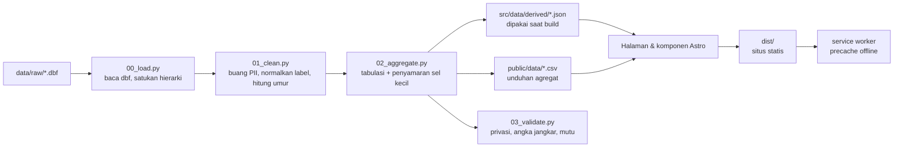

# PRD — Web Data Story Profil Umat Paroki Pugeran

**Nama produk (kerja):** Umat Pugeran dalam Angka
**Paroki:** Hati Kudus Tuhan Yesus (HKTY) Pugeran — Kevikepan DIY, Keuskupan Agung Semarang
**Versi dokumen:** 1.0 · 13 September 2026
**Penyusun:** Krisostomus Nova Rahmanto
**Status:** Draf untuk persetujuan Romo Kepala Paroki & Dewan Paroki
**Acuan praktik:** `laporan-dekan-2026` (Laporan Dekan FMIPA UGM 2021–2026) — pola narasi, pipeline, dan disiplin data diadopsi; identitas visual dan kerangka pilar disusun ulang untuk konteks gereja.

---

## 1. Ringkasan Eksekutif

Paroki Pugeran memiliki basis data sensus umat berisi **12.614 jiwa dalam 4.403 keluarga**, tersebar di **88 lingkungan** dan **19 wilayah**, dengan **60 kolom** atribut per jiwa. Data ini lengkap secara administratif tetapi tidak terbaca sebagai gambaran pastoral: ia hidup di berkas `.dbf` dan lembar Excel, dan hanya bisa dibuka oleh orang yang tahu kode `KET1`–`KET15`.

Produk ini mengubah basis data tersebut menjadi **satu halaman web naratif (*data story*)** yang dapat dibaca Romo Kepala Paroki dari awal sampai akhir dalam 15–20 menit, dan menjawab satu pertanyaan besar: *siapa umat yang dipercayakan kepada paroki ini, dan di mana perhatian pastoral paling dibutuhkan?*

Produk **bukan** dashboard. Pembaca dibawa berurutan: potret dasar → struktur generasi → hidup menggereja → karya dan penghidupan → titik-titik kerentanan → agenda pastoral dan kejujuran soal data yang belum ada.

Tiga keputusan utama yang mengunci PRD ini:

| Keputusan | Pilihan | Konsekuensi |
| --- | --- | --- |
| Cakupan rute | **Satu rute**: cerita panjang (`/`) | Tidak ada deck presentasi dan tidak ada halaman katalog data terpisah. Metodologi dan katalog menjadi babak penutup di dalam halaman yang sama. |
| Distribusi | **Internal, tidak diterbitkan online** | Dibuka dari folder paroki, USB, atau server internal. Agregat boleh turun sampai level lingkungan; data individu tetap tidak pernah keluar dari pipeline. |
| Data | **Snapshot tunggal (± Februari 2019)** | Tidak ada narasi tren antarwaktu. Seluruh cerita disajikan sebagai potret satu waktu, dan batas ini dinyatakan terbuka di pembuka dan penutup. |

---

## 2. Latar dan Masalah

### 2.1 Apa yang sudah ada
Repositori `Dewan Paroki Pugeran` sudah memuat ekspor lengkap basis data umat (`umat.dbf`, `umatkk.dbf`, `lingkung.dbf`, `stasi.dbf`, `paroki.dbf`), skrip R untuk piramida usia, dan delapan grafik PNG hasil render RStudio. Berkas `docs/pugeran dalam angka.txt` memuat daftar keinginan 14 grafik yang disusun per bidang karya Dewan Paroki.

### 2.2 Empat masalah yang membuatnya belum terpakai

1. **Grafik lepas, bukan cerita.** Delapan PNG di `output/charts/` berdiri sendiri tanpa urutan, tanpa pertanyaan, dan tanpa tafsir. Pembaca harus merangkai maknanya sendiri.
2. **Kode belum diterjemahkan.** Kolom `KET1`–`KET15` sudah berisi label, tetapi label seperti `G+L aktif`, `Sah BA`, `N (P)`, `KbM`, dan `bt` tidak dapat dibaca orang di luar operator sensus.
3. **Angka tidak dapat dilacak.** Tidak ada catatan tanggal snapshot, tidak ada definisi, dan tidak ada pencatatan mana angka yang kosong versus mana yang bernilai nol.
4. **Data pribadi melekat di keluaran.** Nama, tempat dan tanggal lahir, serta alamat masih menempel pada setiap baris. Selama itu benar, tidak ada berkas yang aman dibagikan, bahkan di lingkungan internal.

### 2.3 Mengapa sekarang
Dewan Paroki menyusun program kerja per bidang. Tanpa potret umat yang terbaca, perencanaan bidang bersandar pada kesan. Dengan 12.614 jiwa, kesan tidak cukup.

---

## 3. Tujuan, Non-Tujuan, dan Ukuran Keberhasilan

### 3.1 Tujuan
- **T1.** Romo Kepala Paroki memperoleh gambaran menyeluruh profil umat dalam satu kali baca, tanpa perlu bertanya arti satu istilah pun.
- **T2.** Setiap bidang karya Dewan Paroki menemukan bagian yang menjadi wilayahnya dan dapat memakai angkanya untuk menyusun program.
- **T3.** Setiap angka di layar dapat dilacak ke kolom sumber dan definisinya.
- **T4.** Keluaran yang dapat dibuka siapa pun di paroki tidak memuat satu pun data pribadi.
- **T5.** Halaman dapat dibuka tanpa jaringan internet dan dapat dicetak menjadi lampiran rapat.

### 3.2 Non-tujuan (versi 1.0)
- Bukan dashboard interaktif dengan filter bebas, bukan alat kueri, bukan pengganti basis data paroki.
- Tidak ada penelusuran per individu, per keluarga, atau pencarian nama.
- Tidak ada pembaruan data otomatis, tidak ada login, tidak ada API.
- Tidak ada proyeksi, peramalan, atau model statistik inferensial.
- Tidak ada perbandingan antarparoki (data `UMAT KEV DIY.xlsx` disimpan untuk versi berikutnya).
- Tidak ada peta geospasial; batas lingkungan belum tersedia dalam bentuk GeoJSON.

### 3.3 Ukuran keberhasilan

| Ukuran | Target |
| --- | --- |
| Romo Kepala Paroki menyelesaikan bacaan tanpa bertanya arti istilah | 0 pertanyaan istilah pada uji baca |
| Setiap bidang karya menemukan minimal satu adegan yang relevan bagi programnya | 6 dari 6 bidang |
| Angka di layar cocok dengan angka jangkar hasil validasi | 100% |
| Berkas keluaran memuat data pribadi | 0 kolom |
| Halaman utuh terbuka tanpa jaringan setelah satu kali buka | ya |
| Waktu muat halaman penuh di laptop paroki | < 3 detik |
| Berkas cetak (PDF) terbaca rapi | ya, hitam-putih pun terbaca |

---

## 4. Pengguna

| Pengguna | Kebutuhan | Implikasi desain |
| --- | --- | --- |
| **Primer — Romo Kepala Paroki** | Gambaran menyeluruh, cepat, tanpa jargon statistik. Ingin tahu ke mana perhatian diarahkan. | Narasi linear, satu pertanyaan per adegan, kalimat tafsir di bawah setiap grafik, angka besar yang dibaca lebih dulu dari grafiknya. |
| **Sekunder — Dewan Paroki Harian & Ketua Bidang** | Angka yang bisa dipakai menyusun program bidangnya. | Setiap pilar diberi label bidang karya; tabel angka tersedia di bawah setiap grafik. |
| **Sekunder — Ketua Lingkungan & Wilayah** | Melihat posisi lingkungannya terhadap yang lain. | Adegan level lingkungan dengan 88 baris terurut, bukan hanya rata-rata. |
| **Tersier — Tim Litbang / operator data** | Tahu asal angka, definisi, dan apa yang belum tercatat. | Babak penutup: kamus data, catatan mutu, daftar celah data. |

**Konteks pemakaian:** dibuka di laptop atau layar rapat, sesekali di tablet. Bukan produk mobile-first, tetapi harus tetap terbaca pada lebar 400 px.

---

## 5. Sumber Data

### 5.1 Berkas yang dibaca pipeline

| Berkas | Isi | Baris | Peran |
| --- | --- | --- | --- |
| `data/raw/umat.dbf` | Data per jiwa, 60 kolom | 12.614 | Sumber utama seluruh adegan tingkat individu |
| `data/raw/umatkk.dbf` | Data per kepala keluarga, 36 kolom | 4.328 | Ekonomi keluarga, status perkawinan kepala keluarga, jenis rumah tangga |
| `data/raw/lingkung.dbf` | Master 88 lingkungan | 89 | Penamaan dan hierarki lingkungan |
| `data/raw/stasi.dbf` | Master 19 wilayah | 19 | Penamaan dan hierarki wilayah |
| `data/raw/paroki.dbf` | Master paroki se-KAS | 101 | Konteks; tidak dipakai di versi 1.0 |
| `data/reference/LIST LINGKUNGAN.xlsx` | Daftar resmi lingkungan | — | Rekonsiliasi penamaan |

Berkas `.dbf` dibaca langsung. Turunan `.csv` dan `.xlsx` di `data/processed/` adalah hasil konversi manual sebelumnya dan **tidak** menjadi masukan pipeline, agar hanya ada satu sumber untuk satu fakta.

### 5.2 Kunci dan hierarki

```
KEUSKUPAN (30) → PAROKI (30006) → WILAYAH (8 digit, 19) → LINGKUNGAN (12 digit, 88) → NP (15 digit, 4.403 keluarga) → baris umat (12.614 jiwa)
```

`NP` adalah nomor keluarga: 12 digit kode lingkungan ditambah 3 digit urutan keluarga. Ia dipakai sebagai kunci rumah tangga di seluruh agregasi.

### 5.3 Kolom yang dipakai (dan yang dibuang)

Kolom berkode (`JENKEL`, `SUKU`, `PENDIDIKAN`, …) berpasangan dengan kolom label `KET1`–`KET15`. **Pipeline membaca kolom label, bukan kode**, lalu menormalkannya lewat kamus yang dapat diaudit di `pipeline/mappings/`.

| Kolom label | Isi | Kategori |
| --- | --- | --- |
| `KET1` | Jenis kelamin | 2 |
| `KET2` | Hubungan dengan kepala keluarga | 11 |
| `KET3` | Suku | 24 |
| `KET4` | Pendidikan tertinggi | 26 |
| `KET5` | Bidang studi | 68 |
| `KET6` | Pekerjaan | 77 |
| `KET7` | Golongan darah | 5 |
| `KET8` | Status kesehatan | 9 |
| `KET9` | Waktu baptis | 12 |
| `KET10` | Status perkawinan | 13 |
| `KET11` | Agama | 10 |
| `KET12` | Jabatan sosial | 6 |
| `KET13` | Tempat tinggal | 58 |
| `KET14` | Status keterlibatan gerejawi | 9 |
| `KET15` | Keterlibatan pelayanan | 6 |

**Dibuang di tahap `01_clean.py`, tidak pernah ditulis ke keluaran:** `NAMA`, `NAMABAP`, `TMPLAHIR`, `TGLLAHIR` (hanya diturunkan menjadi umur lalu dibuang), `ALAMAT`, `TLP`, `NIK`, `LIBERBAP`, `CAT1`, `TMPBAPTIS`/`TMPKRISMA`/`TMPNIKAH` pada tingkat individu (hanya diturunkan menjadi penanda biner "di Pugeran / bukan"), `TGLBAPTIS`, `TGLKRISMA`, `TGLNIKAH` (hanya diturunkan menjadi ada/tidak ada catatan).

### 5.4 Tanggal snapshot — **pertanyaan terbuka #1**
Tanggal ekstraksi basis data belum tercatat di mana pun. Petunjuk yang ada: tanggal baptis terakhir 2016, dokumentasi foto Februari 2019, dan `Personalia 2019.docx`. PRD ini memakai **1 Februari 2019** sebagai tanggal rujukan perhitungan umur, dan tanggal itu **wajib dikonfirmasi ke pengelola basis data paroki sebelum rilis**. Bila berubah, seluruh angka umur dihitung ulang oleh pipeline; tidak ada angka umur yang ditulis manual.

---

## 6. Prinsip Data dan Privasi

Lima aturan ini mengikat pipeline, bukan sekadar niat. `03_validate.py` menggagalkan proses bila salah satu dilanggar.

1. **Data individu tidak pernah keluar dari pipeline.** Nama, tempat dan tanggal lahir, alamat, telepon, NIK, dan catatan baptis bernomor dibuang di `01_clean.py`. Yang ditulis ke `src/data/derived/` dan `public/data/` hanya tabulasi agregat. Validasi memeriksa daftar hitam kolom dan menggagalkan build bila salah satunya lolos.
2. **Sel kecil disamarkan.** Setiap sel tabulasi yang memuat **1–4 jiwa** ditulis `null` dengan penanda `disamarkan`, bukan `0`. Ambang 5 dipakai — lebih ketat daripada ambang 3 pada acuan FMIPA — karena di lingkungan beranggota 21 jiwa, sel berisi 3 orang praktis menunjuk orang tertentu.
3. **Atribut sensitif tidak disilangkan sampai tingkat individu yang dapat dikenali.** Status kesehatan, ekonomi keluarga, dan status perkawinan boleh ditampilkan sebagai sebaran paroki dan sebagai agregat lingkungan, tetapi **tidak** disilangkan tiga arah (misalnya kesehatan × ekonomi × lingkungan) karena hasilnya menghasilkan sel yang terlalu kecil. Indeks kerentanan pada adegan 5.2 dihitung sebagai skor tunggal per lingkungan, bukan sebagai tabel silang yang dapat dibongkar.
4. **Kosong bukan nol, dan kosong ikut ditampilkan.** Nilai `-`, `bt`, dan sel hampa dinormalkan menjadi kategori **"Tidak tercatat"** yang ikut digambar dalam grafik. Tidak ada persentase yang dihitung diam-diam di atas penyebut yang sudah dibersihkan tanpa mengatakannya.
5. **Anomali diceritakan, bukan diperbaiki diam-diam.** Tanggal nikah tahun 965 dan 2997, baris ganda, dan selisih 75 keluarga antara `umat` dan `umatkk` masuk ke babak penutup sebagai temuan, bukan dihapus.

> **Catatan distribusi.** Produk ini tidak diterbitkan online. Meski begitu seluruh aturan di atas tetap berlaku penuh, karena berkas internal berpindah lewat USB dan surel, dan sekali beredar tidak bisa ditarik kembali.

---

## 7. Arsitektur Teknis

### 7.1 Tumpukan teknologi
- **Astro 7** dengan `output: "static"` — HTML statis, tanpa server, tanpa basis data saat jalan.
- **TypeScript** untuk lapisan data dan utilitas grafik; `astro check` wajib lolos.
- **Python 3.11+** untuk pipeline data (`pandas`, `simpledbf` atau `dbfread` untuk membaca `.dbf`).
- **Grafik digambar sebagai SVG langsung di build time.** Tidak ada pustaka charting pihak ketiga di sisi klien. Alasan: halaman harus jalan tanpa jaringan, ringan di laptop paroki, dan grafiknya harus terbaca saat JavaScript mati.
- **Node 22.12+**, tanpa kerangka kerja UI tambahan.

### 7.2 Pipeline data



| Tahap | Tanggung jawab | Keluaran |
| --- | --- | --- |
| `00_load.py` | Membaca lima `.dbf`, menyatukan hierarki wilayah–lingkungan–keluarga, mencatat jumlah baris mentah | `pipeline/work/raw_*.parquet` |
| `01_clean.py` | Membuang kolom PII, menormalkan label lewat `pipeline/mappings/`, menurunkan umur dari tanggal lahir lalu membuang tanggalnya, menandai baris bermasalah | `pipeline/work/clean.parquet` |
| `02_aggregate.py` | Membangun seluruh tabulasi yang dipakai adegan, menerapkan penyamaran sel < 5 | `src/data/derived/*.json`, `public/data/*.csv` |
| `03_validate.py` | Memeriksa daftar hitam kolom, ambang sel kecil, kecocokan angka jangkar, kelengkapan berkas | `pipeline/work/validation_report.json`, kode keluar ≠ 0 bila gagal |

### 7.3 Perintah proyek

| Perintah | Fungsi |
| --- | --- |
| `npm run dev` | Server pengembangan Astro |
| `npm run data` | `00_load.py` → `01_clean.py` → `02_aggregate.py` |
| `npm run validate:data` | `03_validate.py` |
| `npm run build` | `astro check` → build statis → bangun service worker |
| `npm run verify` | Pipeline + validasi + build + pemeriksaan hasil build |

### 7.4 Struktur repositori

```text
Dewan Paroki Pugeran/
├── data/raw/                     # .dbf sumber (tidak pernah diubah)
├── pipeline/
│   ├── 00_load.py  01_clean.py  02_aggregate.py  03_validate.py
│   ├── mappings/                 # kamus normalisasi yang dapat diaudit
│   ├── utils.py                  # SNAPSHOT, SNAPSHOT_LABEL, ambang sel kecil
│   └── work/                     # ruang kerja lokal, diabaikan Git
├── src/
│   ├── components/               # elemen narasi: Adegan, Pilar, Tafsir, CelahData
│   ├── components/charts/        # komponen grafik reusable
│   ├── data/derived/             # JSON agregat, dibaca saat build
│   ├── i18n/id.ts                # seluruh naskah narasi
│   ├── pages/index.astro         # satu-satunya rute
│   └── styles/                   # tokens.css, global.css, print.css
├── public/
│   ├── data/                     # unduhan agregat tersanitasi
│   ├── fonts/                    # font yang di-host sendiri
│   └── brand/                    # lambang paroki
└── docs/                         # PRD ini dan catatan teknis
```

---

## 8. Struktur Narasi

### 8.1 Kerangka besar

| Babak | Peran | Isi |
| --- | --- | --- |
| **Pembuka** | Menyatakan skala | Empat angka: jiwa, keluarga, lingkungan, wilayah |
| **Babak I — Potret** | Menjawab "siapa dan di mana" | Pilar 1 dan 2 |
| **Babak II — Hidup dan Penghidupan** | Menjawab "bagaimana mereka menggereja dan mencari nafkah" | Pilar 3 dan 4 |
| **Babak III — Perhatian** | Menunjukkan yang belum merata | Pilar 5 |
| **Penutup** | Mengubah potret menjadi pijakan kerja | Agenda pastoral, celah data, batas tafsir |

### 8.2 Lima pilar dan pemetaannya ke bidang karya Dewan Paroki

| Pilar | Judul | Bidang karya yang dilayani |
| --- | --- | --- |
| 1 | Siapa Umat Pugeran | Paguyuban & Tata Organisasi |
| 2 | Generasi dan Regenerasi | Pewartaan; Paguyuban |
| 3 | Hidup Menggereja | Liturgi & Peribadatan; Pewartaan |
| 4 | Karya dan Penghidupan | Pelayanan Kemasyarakatan; Pewartaan (pendidikan) |
| 5 | Perhatian yang Belum Merata | Pelayanan Kemasyarakatan; Penelitian & Pengembangan |

### 8.3 Daftar adegan

Setiap adegan punya struktur tetap: **satu pertanyaan → satu visual → satu kalimat tafsir → sumber**. Tidak ada adegan tanpa pertanyaan, dan tidak ada dua adegan yang menjawab pertanyaan yang sama.

#### Pembuka

| # | Pertanyaan | Bentuk | Angka jangkar |
| --- | --- | --- | --- |
| 0.0 | Seberapa besar paroki ini sebenarnya? | Empat angka besar di atas latar gelap | 12.614 jiwa · 4.403 keluarga · 88 lingkungan · 19 wilayah |

#### Pilar 1 — Siapa Umat Pugeran

| # | Pertanyaan | Bentuk | Angka jangkar |
| --- | --- | --- | --- |
| 1.1 | Berapa jiwa dan berapa keluarga? | Baris kartu statistik | 12.614 jiwa; 4.403 keluarga; rata-rata 2,86 jiwa per keluarga; median 3 |
| 1.2 | Di wilayah mana umat berkumpul? | Batang horizontal, 19 wilayah, terurut | Jogonalan 1.067 tertinggi; Ketanggungan 353 terendah |
| 1.3 | Seberapa timpang beban antarlingkungan? | Lollipop 88 lingkungan, terurut, garis median | Median 137,5 jiwa; terbesar Gedongkiwo Utara 266; terkecil Bugisan Lor 21 — rentang 12,7× |
| 1.4 | Seperti apa bentuk keluarganya? | Batang ukuran rumah tangga 1–9 | 807 keluarga (18,3%) beranggota satu orang; terbesar 9 jiwa |
| 1.5 | Siapa yang memimpin rumah tangga? | Dua batang bertumpuk | 1.318 dari 4.234 keluarga tercatat (31,1%) dikepalai perempuan |
| 1.6 | Dari latar suku apa umat berasal? | Batang horizontal, ekor digabung "Lainnya" | Jawa 11.784 (93,4%); Tionghoa 331; Batak 81; Flores 50; 24 kategori tercatat |

#### Pilar 2 — Generasi dan Regenerasi

| # | Pertanyaan | Bentuk | Angka jangkar |
| --- | --- | --- | --- |
| 2.1 | Bagaimana bentuk piramida umat? | Piramida usia dua sisi, kelompok 5 tahun | Usia valid 12.544; median 43,9 tahun |
| 2.2 | Berapa yang ditanggung dan berapa yang menanggung? | Tiga batang bertumpuk + angka rasio | 0–14: 1.274 (10,2%) · 15–64: 9.169 (73,1%) · 65+: 2.099 (16,7%) · rasio ketergantungan 36,8 |
| 2.3 | Mengapa dasar piramida menyempit? | Batang tiga kohort anak | 0–4 tahun: 119 jiwa; 5–9: 412; 10–14: 743. Kohort balita kurang dari sepertiga kohort di atasnya |
| 2.4 | Seberapa besar kelompok orang muda? | Kartu statistik + sorotan pada piramida | 15–29 tahun: 2.511 jiwa (19,9%) |
| 2.5 | Seperti apa wajah umat lanjut usia? | Piramida tersorot 65+ | 65+: 2.099; 80+: 475. Pada 90–94 tahun, 42 perempuan berbanding 13 laki-laki |
| 2.6 | Mengapa perempuan lebih banyak? | Angka besar + batang per kelompok umur | 6.602 perempuan : 5.852 laki-laki = 88,6 laki-laki per 100 perempuan; 160 jiwa tanpa catatan jenis kelamin |

#### Pilar 3 — Hidup Menggereja

| # | Pertanyaan | Bentuk | Angka jangkar |
| --- | --- | --- | --- |
| 3.1 | Sejauh mana sakramen inisiasi lengkap? | Corong tiga tahap | Baptis 12.614 → Komuni Pertama 10.663 sudah / 1.486 belum → Krisma 8.124 sudah / 4.028 belum; 460 tidak tercatat pada kedua tahap |
| 3.2 | Kapan umat dibaptis? | Batang horizontal | Sebagai anak 10.240 (81,2%); sebagai remaja 855; dari Islam 397; katekumen 193; diterima dari gereja lain 66 |
| 3.3 | Berapa yang berakar di Pugeran, berapa pendatang? | Dua batang berdampingan | Baptis di Pugeran 5.512 (43,7%); krisma di Pugeran 2.827 (22,4%) |
| 3.4 | Bagaimana status perkawinan umat? | Batang horizontal, kategori kanonik | Belum menikah 5.391; Sah Katolik 4.938; Janda/Duda 869; Nikah lagi 530; Sah beda agama 463; Sah beda gereja 140; Ditinggal 92; Kawin belum Sah 47; Hidup bersama 5 |
| 3.5 | Seberapa aktif umat di gereja dan lingkungan? | Batang bertumpuk 100% | Aktif gereja dan lingkungan 8.112 (64,3%); gereja saja 2.404; aktif di luar paroki 424; tidak aktif 897 (7,1%) |
| 3.6 | Siapa yang menggerakkan pelayanan? | Kartu rasio + batang | 1.277 pelayan (10,1%): pengurus lingkungan 977, kategorial 108, tim kerja 79, Dewan Paroki 71, ormas Katolik 42. Satu pelayan untuk setiap 9,9 umat |
| 3.7 | Berapa keluarga yang hidup lintas iman? | Kartu statistik + batang | 654 anggota rumah tangga bukan Katolik tersebar di 558 keluarga; 194 katekumen |

#### Pilar 4 — Karya dan Penghidupan

| # | Pertanyaan | Bentuk | Angka jangkar |
| --- | --- | --- | --- |
| 4.1 | Sampai jenjang apa umat bersekolah? | Batang jenjang, urut naik | SLTA 4.136; S1/D4 2.726; SD 1.804; SLTP 1.399; Diploma 1.162; S2 212; S3 25; belum sekolah 851; buta aksara 94; tidak tercatat 189. Pendidikan tinggi 4.125 (32,7%) |
| 4.2 | Berapa yang bersekolah di sekolah Katolik? | Batang + kartu celah data | Dari 1.780 jiwa yang penandanya tercatat: 1.185 sekolah Katolik, 595 bukan. **10.834 jiwa (85,9%) tanpa penanda — pertanyaan ini belum bisa dijawab** |
| 4.3 | Di bidang apa umat menempuh studi? | Batang horizontal 15 teratas | Terisi 3.187 (25,3%): Ekonomi 387, Pendidikan 318, Akuntansi 247, Manajemen 195, Teknik 195, Hukum 171 |
| 4.4 | Dari apa umat hidup? | Batang horizontal, dikelompokkan | Swasta 2.589; Ibu rumah tangga 1.649; Pensiun 914; Pelajar 850; PNS/karyawan 709; Mahasiswa 490; buruh 283; tidak tercatat 2.476 (19,6%) |
| 4.5 | Bagaimana kondisi ekonomi keluarga? | Batang bertumpuk 100% | Biasa/cukup 3.081 (71,2%); bisa membantu 781 (18,1%); **memerlukan bantuan 462 (10,7%)** |
| 4.6 | Berapa umat yang memegang peran publik? | Kartu statistik + batang | 563 jiwa (4,5%): pengurus RT/RW/Desa 464, ormas 59, LSM 40 |

#### Pilar 5 — Perhatian yang Belum Merata

| # | Pertanyaan | Bentuk | Angka jangkar |
| --- | --- | --- | --- |
| 5.1 | Berapa umat yang memerlukan perhatian kesehatan? | Batang horizontal | 286 jiwa (2,3%) di luar kategori normal: kronis 72, cacat fisik 71, keterlambatan 63, pikun 31, sulit mengingat 24, buta 14, bisu/tuli 11 |
| 5.2 | Lingkungan mana yang paling perlu dikunjungi? | Tabel panas 88 baris, ramp sekuensial, terurut skor | Indeks kerentanan lingkungan = gabungan proporsi 65+, proporsi keluarga "memerlukan bantuan", dan proporsi rumah tangga satu orang. Rumus dan bobot dicantumkan di bawah tabel |
| 5.3 | Berapa lansia yang tinggal sendiri? | Kartu statistik | Dari 807 rumah tangga satu orang: 482 berusia 65+, dan 261 di antaranya berusia 75+ |
| 5.4 | Siapa umat yang jauh dari paroki? | Batang horizontal | 373 jiwa (3,0%) tinggal di luar paroki — Jakarta 149, Surabaya 23, luar negeri 15; ditambah 69 jiwa indekos di dalam paroki |
| 5.5 | Siapa yang sudah lama tidak terlihat? | Batang + kalimat tafsir | 897 jiwa (7,1%) tercatat tidak aktif; 342 aktif di lingkungan tetapi tidak di gereja paroki |
| 5.6 | Apakah paroki siap menolong saat darurat? | Batang golongan darah + kartu celah data | O 4.147; B 2.746; A 2.233; AB 766; **2.722 jiwa (21,6%) belum tercatat golongan darahnya** |

#### Penutup

| # | Isi | Bentuk |
| --- | --- | --- |
| 6.1 | **Enam hal yang angka ini sarankan** — agenda pastoral yang diturunkan langsung dari adegan, masing-masing menyebut nomor adegannya | Kartu agenda |
| 6.2 | **Apa yang belum tercatat** — daftar celah data dengan besaran nyata | Kartu celah data (lihat §12) |
| 6.3 | **Bagaimana angka ini dibaca** — tanggal snapshot, definisi, batas tafsir, kamus istilah | Tabel + prosa |

**Total: 1 adegan pembuka + 27 adegan bernomor + 3 bagian penutup.**

### 8.4 Aturan penulisan naskah
- Satu adegan, satu pertanyaan. Judul adegan ditulis sebagai pertanyaan.
- Kalimat tafsir menyatakan **apa yang terlihat**, bukan apa yang seharusnya dilakukan. Rekomendasi hanya muncul di bagian 6.1.
- Istilah basis data tidak pernah muncul apa adanya. `Sah BA` ditulis "perkawinan sah dengan pasangan beda agama"; `G+L aktif` ditulis "aktif di gereja dan di lingkungan"; `bt` dan `-` menjadi "tidak tercatat".
- Persentase selalu menyebut penyebutnya bila penyebutnya bukan 12.614.
- Tidak ada kalimat yang menghakimi status hidup umat. Adegan 3.4 melaporkan sebaran; ia tidak memberi label pada orang.
- Seluruh naskah hidup di `src/i18n/id.ts`. Angka di dalam kalimat **diambil dari JSON turunan**, tidak diketik manual, supaya naskah dan grafik tidak pernah berbeda.

---

## 9. Sistem Desain

### 9.1 Karakter visual
Elegan, modern, korporat — dan berakar pada gereja tempat data ini berasal. Rujukan bentuk: arsitektur neo-gotik Gereja HKTY Pugeran dan warna liturgi Hati Kudus. Wujudnya: **kertas hangat, tipografi serif untuk suara naratif, garis tipis, sudut hampir tegak, merah bordo sebagai warna institusi, dan emas sebagai aksen yang jarang.**

Yang dihindari: gradien, bayangan tebal, ikon berwarna-warni, sudut membulat besar, dan efek kaca.

### 9.2 Warna institusi (chrome — tidak pernah menjadi warna data)

| Token | Nilai | Peran | Kontras di kertas |
| --- | --- | --- | --- |
| `--hkty-bordeaux` | `#8A1C2B` | Warna institusi: judul pilar, garis pemisah, latar pembuka | 8,68:1 |
| `--hkty-bordeaux-deep` | `#5E1220` | Latar gelap adegan pembuka | — |
| `--hkty-gold` | `#C9A227` | **Aksen saja**: garis bawah judul, penanda kutipan, tanda kunci | 2,28:1 — **tidak pernah untuk teks di kertas**, hanya di atas bidang gelap atau sebagai garis |
| `--ink` | `#26221F` | Teks utama | 14,87:1 |
| `--ink-secondary` | `#5B534D` | Teks pendukung, label sumbu | 7,10:1 |
| `--paper` | `#FAF8F4` | Latar halaman dan permukaan grafik | — |
| `--surface-card` | `#FFFFFF` | Kartu dan tabel | — |
| `--surface-dark` | `#1B1719` | Permukaan mode gelap | — |
| `--ink-on-dark` | `#F4EFE7` | Teks di atas bidang gelap | 12,61:1 |

> **Aturan keras:** bordo dan emas adalah identitas, bukan seri data. Keduanya tidak pernah dipakai untuk membedakan kategori dalam grafik.

### 9.3 Palet seri data — **sudah divalidasi**

Lima slot, urutan tetap, tidak pernah diputar ulang. Nilai di bawah lolos seluruh gerbang keras pada pasangan bersebelahan (batang, batang bertumpuk, garis) di kedua mode, diuji dengan `validate_palette.js`.

| Slot | Nama | Terang (di `#FAF8F4`) | Gelap (di `#1B1719`) |
| --- | --- | --- | --- |
| 1 | Biru nila | `#1F6FA8` | `#3D88C2` |
| 2 | Terakota | `#C2542F` | `#D2653D` |
| 3 | Hijau liturgi | `#1B8A63` | `#2FA37B` |
| 4 | Ungu adven | `#6B4C9A` | `#9184D8` |
| 5 | Merah bata | `#B02A3A` | `#D4606E` |

Hasil validasi:

| Pemeriksaan | Terang | Gelap |
| --- | --- | --- |
| Rentang kecerahan OKLCH | lolos | lolos |
| Ambang kroma | lolos | lolos |
| Pemisahan buta warna (pasangan bersebelahan) | lolos — terburuk ΔE 8,4 (deutan) | lolos — terburuk ΔE 8,3 (deutan) |
| Ambang penglihatan normal | lolos — terburuk ΔE 19,1 | lolos — terburuk ΔE 18,5 |
| Kontras terhadap permukaan | lolos — semua ≥ 3:1 | lolos — semua ≥ 3:1 |

**Batas jumlah seri.** Untuk bentuk yang menampilkan semua pasangan sekaligus (sebar, gelembung), palet hanya aman sampai **tiga slot pertama** (divalidasi `--pairs all`: ΔE buta warna 8,4 terang / 8,3 gelap; penglihatan normal 15,5 terang / 15,4 gelap). Kategori keenam dan seterusnya **selalu** dilipat menjadi "Lainnya" atau dipecah menjadi grafik kecil berulang — tidak pernah dibuatkan warna baru.

### 9.4 Ramp sekuensial (besaran — tabel panas lingkungan)

Satu warna, terang ke gelap. Divalidasi sebagai ramp ordinal.

| Mode | Langkah |
| --- | --- |
| Terang | `#8CB4D3` → `#6494BC` → `#3F76A5` → `#22598B` → `#0F3F66` |
| Gelap | `#22598B` → `#3F76A5` → `#6494BC` → `#8CB4D3` → `#B5D0E4` |

### 9.5 Pasangan divergen dan warna status

- **Divergen** (selisih terhadap rata-rata paroki): `#22598B` ↔ netral `#EFEBE4` (terang) / `#33302C` (gelap) ↔ `#B02A3A`. Lolos pemeriksaan CVD ΔE 13,0.
- **Status** (tiga tingkat, **selalu dengan ikon dan label — tidak pernah warna saja**): baik `#2E7D52`; perlu perhatian `#A97400`; prioritas `#A32020`. Warna status tidak pernah dipakai ulang sebagai warna seri.

### 9.6 Tipografi

| Peran | Huruf | Catatan |
| --- | --- | --- |
| Naratif dan judul | **Source Serif 4** (SIL OFL) | Suara laporan; membawa nuansa cetak dan warisan |
| Antarmuka, label, angka | **Inter** (SIL OFL) | Angka tabular untuk tabel dan sumbu |
| Kode dan nilai mentah | `ui-monospace` | Hanya di bagian metodologi |

Kedua huruf **di-host sendiri** di `public/fonts/` sebagai `woff2` subset Latin. Tidak ada permintaan ke Google Fonts — halaman harus utuh tanpa jaringan.

Tangga ukuran (rem): `0,75 · 0,875 · 1 · 1,25 · 1,5 · 1,875 · 2,25 · 3 · 4`; angka pembuka memakai `clamp(3rem, 8vw, 5rem)`. Lebar baris teks dibatasi 68 karakter.

### 9.7 Tata letak dan mode gelap
- Kisi ruang 4 px. Lebar konten maksimum 75 rem; grafik boleh melebar sampai 88 rem.
- Mode gelap **dipilih lewat sakelar** (`data-theme="dark"`), tidak diambil otomatis dari preferensi sistem — ruang rapat paroki memakai proyektor, dan mode yang berubah sendiri mengejutkan penyaji.
- Gerak dibatasi: hanya transisi opasitas dan pergeseran halus saat adegan masuk layar, seluruhnya dimatikan pada `prefers-reduced-motion`.

---

## 10. Pustaka Komponen Visualisasi

Sembilan komponen. Tidak ada komponen kesepuluh tanpa alasan yang tertulis di PRD.

| Komponen | Dipakai di | Alasan bentuk |
| --- | --- | --- |
| `StatCards` | 0.0, 1.1, 2.4, 3.6, 3.7, 4.6, 5.3 | Satu angka adalah satu angka; ia tidak butuh grafik |
| `HorizontalBar` | 1.2, 1.6, 3.2, 3.4, 4.1, 4.3, 4.4, 5.1, 5.4, 5.6 | Perbandingan besaran antarkategori dengan label panjang dalam bahasa Indonesia |
| `PopulationPyramid` | 2.1, 2.5 | Bentuk baku demografi; dua sisi berbagi satu sumbu usia |
| `StackedBar100` | 1.5, 2.2, 3.5, 4.5 | Komposisi bagian terhadap keseluruhan |
| `Lollipop` | 1.3 | 88 baris; batang penuh akan menjadi dinding tinta, titik dan garis tipis tetap terbaca |
| `FunnelFlow` | 3.1 | Tahapan berurutan dengan penyusutan di tiap tahap |
| `HeatTable` | 5.2 | 88 baris × beberapa kolom, diberi warna dengan ramp sekuensial |
| `CohortBars` | 2.3, 2.6 | Batang sederhana yang menyorot satu perbandingan |
| `DataGapCard` | 4.2, 5.6, 6.2 | Celah data adalah temuan; ia butuh bentuknya sendiri |

**Aturan yang berlaku untuk semua komponen:**
- Sumbu tunggal. Tidak pernah dua skala Y dalam satu grafik.
- Warna mengikuti entitas, bukan peringkat. Mengurutkan ulang tidak mengubah warna kategori.
- Tanda tipis: garis 2 px, ujung data membulat 4 px, celah 2 px antarsegmen bertumpuk.
- Teks memakai token teks (`--ink`, `--ink-secondary`), tidak pernah memakai warna seri.
- Untuk dua seri atau lebih, legenda selalu ada; sampai empat seri ditambah label langsung, sehingga identitas tidak pernah bergantung pada warna saja.
- Setiap grafik memiliki `<figcaption>`, label aksesibel, dan **tabel angka alternatif** yang dapat dibuka di bawahnya.
- Setiap grafik dapat dipahami tanpa hover. Tooltip adalah tambahan, bukan syarat.
- Setiap grafik menyebut sumbernya: berkas, kolom, dan penyebut.

---

## 11. Aksesibilitas, Performa, Cetak, dan Offline

### 11.1 Aksesibilitas
- Kontras teks minimal 4,5:1; tanda grafik minimal 3:1 terhadap permukaan.
- Seluruh isi terbaca tanpa JavaScript; grafik adalah SVG yang dirender saat build.
- Struktur judul berurutan (`h1` → `h2` → `h3`), penanda fokus terlihat, dukungan `forced-colors`.
- Tabel alternatif untuk setiap grafik; tidak ada informasi yang hanya disampaikan lewat warna.
- Bahasa halaman `lang="id"`.

### 11.2 Performa
- Halaman penuh (HTML + CSS + font + SVG) di bawah **2 MB**; muat penuh di bawah **3 detik** pada laptop paroki.
- Tidak ada pustaka charting di sisi klien. JavaScript hanya untuk sakelar tema, progres baca, buka-tutup tabel, dan tooltip.

### 11.3 Cetak
Lembar gaya cetak khusus: latar putih, grafik hitam-putih dengan tekstur pembeda, tabel alternatif ikut tercetak, tautan diperlihatkan URL-nya, pemisah halaman per pilar. Hasil: satu PDF yang bisa dibagikan di rapat Dewan Paroki tanpa perangkat.

### 11.4 Offline
Service worker menyimpan seluruh isi `dist/` dengan cache berversi yang dibangun ulang setiap build. Setelah satu kali dibuka, halaman terbuka penuh tanpa jaringan. Karena distribusi bersifat internal, folder `dist/` juga dapat disalin ke USB dan dibuka langsung dari berkas.

---

## 12. Kualitas Data dan Celah Data

Bagian ini wajib tampil di halaman (adegan 6.2), bukan hanya di dokumen ini. Angka berikut dihitung dari `umat.dbf` dan `umatkk.dbf`.

### 12.1 Kolom yang banyak kosong

| Kolom | Kosong / tidak tercatat | Akibat |
| --- | --- | --- |
| Bidang studi | 9.427 dari 12.614 (74,7%) | Adegan 4.3 hanya menggambarkan 3.187 jiwa yang tercatat, dan mengatakannya |
| Penanda sekolah Katolik | 10.834 (85,9%) | Adegan 4.2 **tidak menyimpulkan apa pun**; ia melaporkan celah datanya |
| Golongan darah | 2.722 (21,6%) | Adegan 5.6 menampilkan "belum tercatat" sebagai batang tersendiri |
| Pekerjaan | 2.476 (19,6%) | Kategori "tidak tercatat" ikut digambar |
| Tanggal krisma | 8.713 (69,1%) | Tidak ada adegan berbasis tahun krisma |
| Tanggal baptis | 3.680 (29,2%) | Tidak ada adegan berbasis tahun baptis |
| Jenis kelamin | 160 (1,3%) | Piramida usia menyebut 160 jiwa yang tidak dapat ditempatkan |
| Tanggal lahir | 69 (0,5%) | 12.544 jiwa masuk perhitungan umur; 70 jiwa dinyatakan di luar hitungan |

### 12.2 Anomali yang diceritakan, bukan dihapus

| Temuan | Jumlah | Perlakuan |
| --- | --- | --- |
| Baris dengan nama dan tanggal lahir identik | 580 baris (290 pasang) | Ditandai di laporan validasi; tidak dihapus otomatis karena kembar dan kesamaan nama mungkin. Dilaporkan sebagai **dugaan duplikat yang perlu ditinjau paroki** |
| Selisih jumlah keluarga antarsumber | `umat.dbf` 4.403 vs `umatkk.dbf` 4.328 — selisih **75** | Dilaporkan terbuka. Angka keluarga di seluruh cerita memakai `umat.dbf` (4.403), dan setiap adegan yang memakai `umatkk.dbf` menyebut penyebutnya sendiri |
| Tanggal lahir di luar akal | 1 baris (tahun > 2019) | Dikeluarkan dari perhitungan umur, dicatat di laporan validasi |
| Tanggal nikah di luar akal | 8 baris (antara lain tahun 965 dan 2997) | Dikeluarkan, dicatat |
| Tanggal nikah kosong | 1.412 dari 4.328 (32,6%) | Tidak ada adegan berbasis tahun nikah |
| Kepala keluarga tanpa catatan jenis kelamin | 94 | Penyebut adegan 1.5 adalah 4.234, dan disebutkan di grafik |

### 12.3 Enam usulan pembaruan sensus (adegan 6.2)
Diturunkan langsung dari tabel di atas: lengkapi golongan darah (2.722 jiwa), lengkapi pekerjaan (2.476 jiwa), tinjau 290 pasang dugaan duplikat, rekonsiliasi 75 keluarga yang berbeda antarsumber, catat penanda sekolah Katolik bila bidang pendidikan memerlukannya, dan **catat tanggal ekstraksi pada setiap ekspor berikutnya.**

---

## 13. Batas Interpretasi

Ditampilkan di adegan 6.3, dan dirujuk singkat di pembuka.

1. **Ini potret satu waktu, bukan tren.** Seluruh angka berasal dari satu snapshot (± Februari 2019). Tidak ada perbandingan antartahun, dan tidak boleh ada kalimat "meningkat" atau "menurun" di seluruh naskah.
2. **Umur dihitung terhadap tanggal rujukan, bukan hari ini.** Bila halaman dibuka bertahun-tahun kemudian, umur di layar tetap umur pada tanggal snapshot. Tanggal itu ditulis di setiap grafik berbasis umur.
3. **"Tidak tercatat" bukan "tidak ada".** Umat tanpa catatan golongan darah tetap punya golongan darah. Grafik melaporkan catatan administrasi, bukan kenyataan.
4. **Keaktifan adalah penilaian pencatat, bukan ukuran objektif.** Status `G+L aktif` dan turunannya diisi petugas lingkungan pada saat sensus. Angka 7,1% "tidak aktif" harus dibaca sebagai indikasi yang perlu diverifikasi lapangan, bukan vonis.
5. **Ekonomi keluarga adalah kategori tiga tingkat yang diisi pencatat**, bukan pengukuran pendapatan.
6. **Indeks kerentanan lingkungan (5.2) adalah alat bantu prioritas, bukan peringkat kemiskinan.** Rumus, bobot, dan keterbatasannya dicantumkan tepat di bawah tabelnya.
7. **Umat yang tinggal di luar paroki tetap terdaftar di sini.** Angka 12.614 adalah jumlah terdaftar, bukan jumlah yang hadir di misa.

---

## 14. Kriteria Penerimaan

Versi 1.0 dinyatakan selesai bila seluruh butir berikut terpenuhi.

**Data**
- [ ] `npm run verify` lolos tanpa galat dari pipeline sampai pemeriksaan hasil build.
- [ ] `03_validate.py` memastikan tidak ada kolom PII di `src/data/derived/` maupun `public/data/`.
- [ ] Tidak ada sel tabulasi bernilai 1–4 yang lolos tanpa penyamaran.
- [ ] Seluruh angka jangkar di §8.3 cocok dengan keluaran pipeline.
- [ ] `pipeline/mappings/` memuat seluruh kamus normalisasi, dan tidak ada normalisasi yang ditulis langsung di dalam kode.

**Narasi**
- [ ] 1 adegan pembuka + 27 adegan bernomor + 3 bagian penutup tersedia.
- [ ] Setiap adegan punya pertanyaan, visual, satu kalimat tafsir, dan sumber.
- [ ] Tidak ada istilah basis data mentah yang muncul di naskah.
- [ ] Setiap angka dalam kalimat naskah berasal dari JSON turunan, bukan diketik manual.
- [ ] Rekomendasi hanya muncul di bagian 6.1.

**Visual**
- [ ] Palet seri lolos `validate_palette.js` pada kedua mode.
- [ ] Bordo dan emas tidak muncul sebagai warna seri di satu grafik pun.
- [ ] Setiap grafik punya legenda (≥ 2 seri), label aksesibel, dan tabel angka alternatif.
- [ ] Tidak ada grafik bersumbu ganda.

**Teknis**
- [ ] Seluruh isi terbaca dengan JavaScript dimatikan.
- [ ] Halaman terbuka penuh tanpa jaringan setelah satu kali dibuka.
- [ ] Cetak menghasilkan PDF yang terbaca hitam-putih.
- [ ] Halaman terbaca pada lebar 400 px tanpa gulir horizontal.
- [ ] Font dimuat dari `public/fonts/`, tanpa satu pun permintaan ke domain luar.

**Uji baca**
- [ ] Romo Kepala Paroki membaca dari awal sampai akhir dan tidak menanyakan arti satu istilah pun.
- [ ] Enam ketua bidang masing-masing dapat menunjuk adegan yang relevan bagi programnya.

---

## 15. Rencana Kerja

| Tahap | Isi | Keluaran |
| --- | --- | --- |
| **0. Konfirmasi** | Pastikan tanggal snapshot; konfirmasi kerangka lima pilar ke Romo Kepala Paroki | Tanggal rujukan terkunci; kerangka disetujui |
| **1. Fondasi data** | `00_load.py`, `01_clean.py`, kamus di `pipeline/mappings/` | `clean.parquet`, kamus lengkap |
| **2. Agregasi & validasi** | `02_aggregate.py`, `03_validate.py`, penyamaran sel kecil | Seluruh JSON turunan + laporan validasi |
| **3. Rangka aplikasi** | Proyek Astro, `tokens.css`, tata letak, sakelar tema, gaya cetak | Kerangka halaman berjalan |
| **4. Pustaka grafik** | Sembilan komponen + tabel alternatif + tooltip | Pustaka lengkap dengan halaman uji |
| **5. Adegan** | Pilar 1 → 5 → penutup, naskah di `src/i18n/id.ts` | Cerita utuh |
| **6. Penyelesaian** | Aksesibilitas, cetak, service worker, uji baca | Rilis 1.0 |

---

## 16. Risiko dan Mitigasi

| Risiko | Dampak | Mitigasi |
| --- | --- | --- |
| Tanggal snapshot tidak pernah terkonfirmasi | Seluruh angka umur kehilangan dasar | Tanggal rujukan ditulis sebagai konstanta tunggal di `pipeline/utils.py` dan ditampilkan di setiap grafik umur; bila tetap tidak diketahui, halaman menyatakannya sebagai asumsi secara terbuka |
| Berkas keluaran beredar lewat USB dan surel | Kebocoran data umat | Tidak ada data individu yang pernah ditulis ke keluaran; validasi menggagalkan build bila ada |
| Data 2019 dianggap keadaan hari ini | Keputusan pastoral salah sasaran | Tanggal snapshot muncul di pembuka, di penutup, dan di setiap grafik berbasis umur |
| Adegan 5.2 dibaca sebagai peringkat kemiskinan lingkungan | Stigma antarlingkungan | Rumus, bobot, dan batas tafsir dicantumkan di bawah tabel; judul memakai kata "prioritas kunjungan", bukan "termiskin" |
| Adegan 3.4 dan 3.5 dibaca sebagai penilaian atas pribadi umat | Melukai umat | Naskah melaporkan sebaran tanpa melabeli orang; tidak ada penelusuran ke individu |
| Kategori data terlalu banyak (77 pekerjaan, 68 bidang studi) | Grafik menjadi dinding tinta | Ekor dilipat menjadi "Lainnya" dengan ambang yang dicatat di `pipeline/mappings/`; daftar penuh tersedia di unduhan agregat |
| Cakupan melebar menjadi dashboard | Rilis tidak pernah selesai | Non-tujuan di §3.2 mengikat; usulan baru masuk daftar versi 2.0 |

---

## 17. Lampiran

### 17.1 Kamus istilah untuk pembaca (dipakai di adegan 6.3)

| Istilah di basis data | Yang ditulis di halaman |
| --- | --- |
| `G+L aktif` | Aktif di gereja paroki dan di lingkungan |
| `Gereja` | Aktif di gereja, tidak aktif di lingkungan |
| `G nonP, L aktif` | Aktif di lingkungan, beribadat di paroki lain |
| `G+L luar P` | Aktif di gereja dan lingkungan paroki lain |
| `non A` / `N (P)` | Tercatat tidak aktif |
| `Sah K` | Perkawinan sah secara Katolik |
| `Sah BA` | Perkawinan sah dengan pasangan beda agama |
| `Sah BG` | Perkawinan sah dengan pasangan beda gereja |
| `Nikah LG` | Menikah lagi |
| `KbM` | Kawin belum sah menurut Gereja |
| `BLM` | Belum menikah |
| `P. Link` | Pengurus lingkungan |
| `P. Kategorial` | Pengurus kelompok kategorial |
| `P. Tim Kerja` | Pengurus tim kerja paroki |
| `Anggota DP` | Anggota Dewan Paroki |
| `bt` / `-` | Tidak tercatat |

### 17.2 Angka jangkar (diperiksa `03_validate.py`)

```
umat_total            = 12614
keluarga_total        = 4403
wilayah_total         = 19
lingkungan_total      = 88
laki_laki             = 5852
perempuan             = 6602
jenkel_tidak_tercatat = 160
umur_valid            = 12544
umur_median           = 43.9
usia_0_14             = 1274
usia_15_64            = 9169
usia_65_plus          = 2099
rasio_ketergantungan  = 36.8
rumah_tangga_1_orang  = 807
lansia_tinggal_sendiri= 482
pelayan_total         = 1277
komuni_sudah          = 10663
krisma_sudah          = 8124
kawin_sah_katolik     = 4938
aktif_gereja_lingkungan = 8112
tidak_aktif           = 897
ekonomi_perlu_bantuan = 462
kesehatan_perlu_perhatian = 286
goldarah_tidak_tercatat = 2722
```

### 17.3 Yang ditunda ke versi berikutnya
Perbandingan dengan paroki lain se-Kevikepan DIY (`UMAT KEV DIY.xlsx`); peta lingkungan bila GeoJSON batas tersedia; penghubungan dengan `PROGRAM KERJA RUTIN DAN INVESTASI.xlsx` dan `PROGRAM VISIONER 2018.xlsx` agar profil umat dan program kerja terbaca berdampingan; dan perbandingan antarwaktu begitu sensus berikutnya selesai.

### 17.4 Pertanyaan terbuka

1. **Tanggal ekstraksi basis data** — belum tercatat; PRD memakai asumsi 1 Februari 2019 (§5.4).
2. **Kerangka lima pilar** — perlu konfirmasi Romo Kepala Paroki sebelum tahap 1 dimulai.
3. **Ambang penyamaran sel kecil** — PRD menetapkan 5; perlu persetujuan bila dewan menghendaki angka lain.
4. **Bobot indeks kerentanan (5.2)** — usulan awal bobot sama rata untuk tiga komponen; perlu ditinjau bidang Pelayanan Kemasyarakatan.
5. **Penempatan berkas hasil build** — folder paroki, server internal, atau USB.
